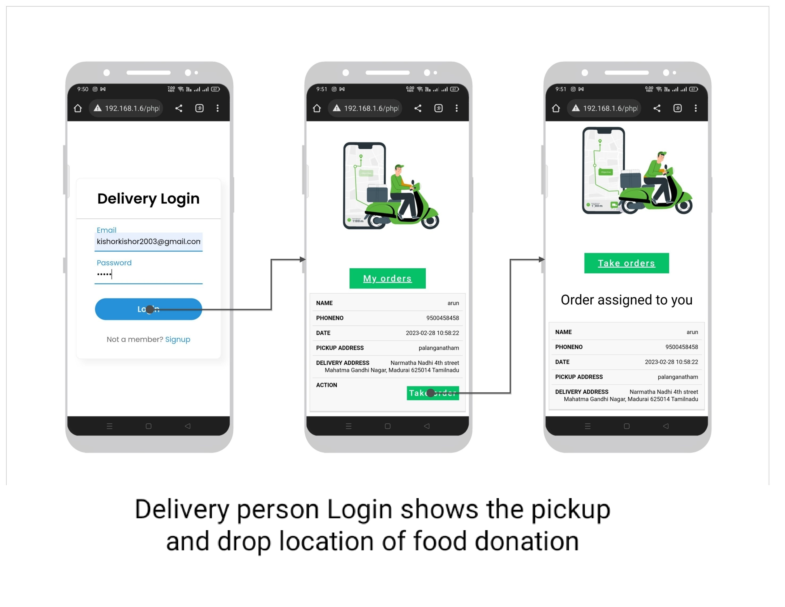

# Food Connect 

> A smart initiative to minimize food wastage and help those in need.

<!--  -->

The **Food Waste Management System** is designed to collect excess or leftover food from donors such as hotels, restaurants, marriage halls, and individuals, and redistribute it efficiently to underprivileged and needy communities.

## Tools and Technologies Used

- **Frontend:** HTML, CSS, JavaScript  
- **Backend:** PHP  
- **Web Server:** XAMPP Server  
- **Database:** MySQL  

## System Modules

The application is divided into three main modules:

- **User Module**
- **Admin Module**
- **Delivery Person Module**

---

## Module Descriptions

### User Module

The **User Module** is for individuals or organizations (restaurants, marriage halls, etc.) who want to donate excess food.  
Key functionalities:
- User registration and secure login.
- Donate food by specifying type and quantity.
- View donation history and status.
- Donations are shared with the Admin for further processing.

---

### Admin Module

The **Admin Module** is operated by registered trusts, NGOs, and charities.  
Responsibilities include:
- Manage and monitor food donations.
- Approve or list donations received.
- Allocate donations to NGOs and schedule pickups.
- Track requests and maintain records of food distribution.

---

### Delivery Person Module

The **Delivery Module** connects delivery personnel who are responsible for picking up and delivering food donations.  
Features:
- Registration and login.
- View assigned pickup and drop-off locations.
- Update delivery status upon successful drop-off.

---

## Key Features

- **Responsive Design:**  
  Mobile-friendly interface for seamless access across devices.

- **Chatbot Support:**  
  Integrated chatbot for assistance and FAQs.

- **Secure Login:**  
  Secure authentication using password hashing mechanisms.

---

## Screenshots

### User Interface
<!--  -->

### Admin Panel

### Delivery Module

---

### Responsive Design

### Chatbot Support

### Secure Login Flow

---

## How to Run the Project

1. Download or clone the project repository.
2. Extract the downloaded zip file (if applicable).
3. Copy the project folder.
4. Paste it inside the root directory:
   - For XAMPP: `xampp/htdocs`
   - For WAMP: `wamp/www`
   - For LAMP: `var/www/html`
5. Open [PHPMyAdmin](http://localhost/phpmyadmin).
6. Create a new database.
7. Import the `demo.sql` file located inside the `database` folder.
8. Open your browser and run the project at:  
   `http://localhost/your-folder-name`

---

## Live Demo

[View Demo](https://kishor-23.github.io/food-donate/index.html)

---

## Author

Developed and maintained by [Aditya Singh Mandrawal](https://github.com/AdityaSinghMandrawal).

> Feel free to ⭐ the repository if you find it useful!
